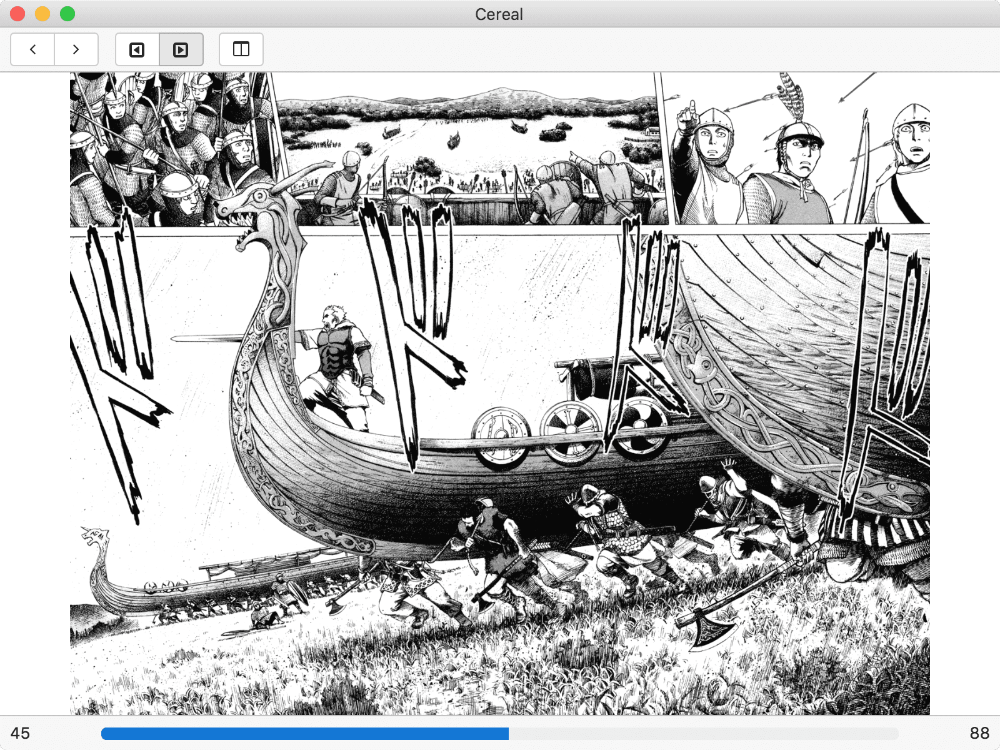

# Cereal 🍜

> A comic viewer



## Build Setup

``` bash
# Install dependencies
npm install

# Serve with hot reload at localhost:9080
npm run dev

# Build electron app for production
npm run build

# Lint all JS/Vue component files in `app/src`
npm run lint

# Run webpack in production
npm run pack
```
